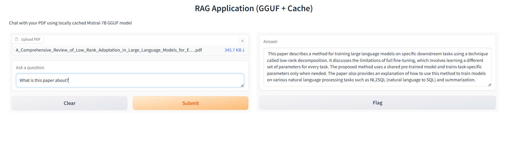

# 🌍 PDF chatbot

## 🛠 Installation & Setup

### 1️⃣ Setting up **environments**

#### Steps to set up the environment:

```sh
# Create a Conda environment on anaconda prompt
conda create --name qa_chatbot python=3.11 -y

# Activate the environment
conda activate qa_chatbot

# Install required dependencies
conda install requirements.txt
```
---

## 🚀 Running the Application

### Running application
```
python app.py
```
### 🖼️ Application UI

---
